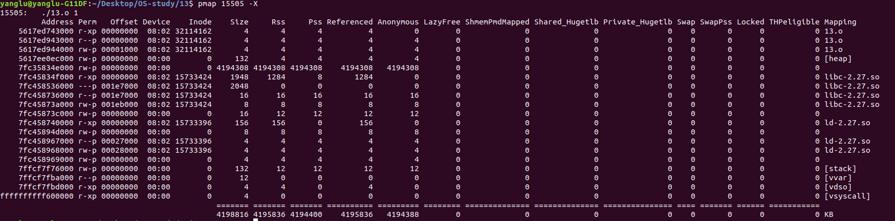

1. skip

2. ```
   $ free -h
                 total        used        free      shared  buff/cache   available
   Mem:            15G        2.3G        9.3G        123M        4.0G         12G
   Swap:          2.0G          0B        2.0G
   ```

3. Note that something like `(void)a[i]` doesn't actually touch the array. Based on my observation, no memory will be used, the code is probably optimized out(need some knowledge of assembly which at this moment I don't have...). We need something like `a[i]++`.

4. My program allocates 1G * 4 Byte = 4 GB. And with it running:

   ```
   $ free -h
                 total        used        free      shared  buff/cache   available
   Mem:            15G        6.3G        5.3G        123M        4.0G        8.9G
   Swap:          2.0G          0B        2.0G
   ```

   But the memory is actually raising up gradually, instead of taking up 4GB immediately.

   If too much, I hit seg fault.

5. skip

6. skip

7. skip

8. 

   We can see the 4GB is allocated on heap.

   This value changes if the program changes the number.

   As a bonus, I also tried something like `int b[size]`, and it indeed goes to stack. But stack is very easily overflown.